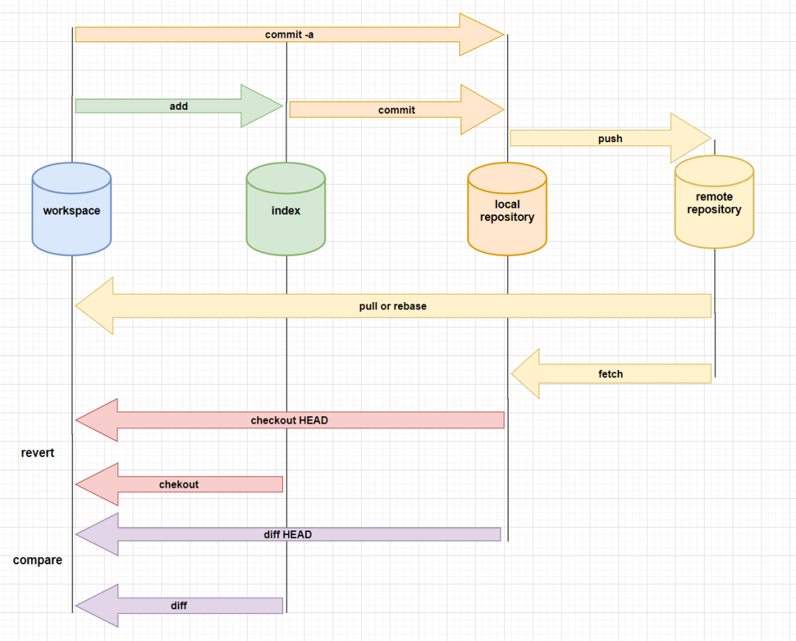

# git 常用操作



## 常用命令


``` bash

回滚到合并之前
git reset --merge. 或者 git merge --abort

查看远程地址
git remote -v

查看远程
git remote show
```

## 同时提交两个远程库

``` bash
[remote "all"]
	url = git@github.com:meiminjun/Notebook.git
	url = git@gitee.com:meiminjun/Notebook.git
	tagopt = --no-tags
```
